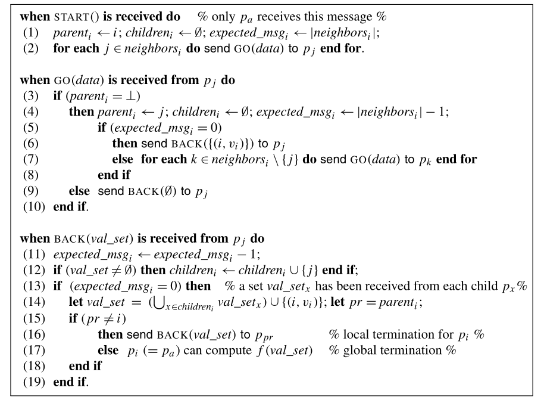

# Distributed RST

### Distributed Rooted Spanning Tree

An implementation of a distributed rooted spanning tree following the definition put forward by Michel Raynal in _Distributed Algorithm's for Message Passing Systems._

