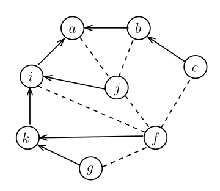
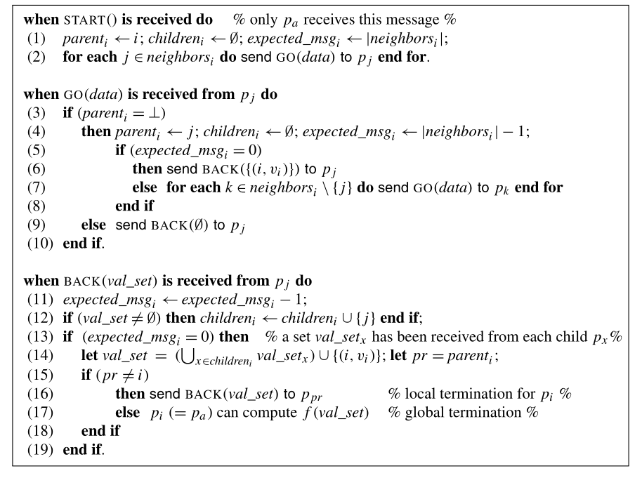

# Distributed Rooted Spanning Tree

An implementation of a distributed rooted spanning tree following the definition put forward by Michel Raynal in _Distributed Algorithm's for Message Passing Systems._

### Example graph

- Dotted edges represent channels not belonging to the spanning tree.
- Filled edges represent channels with arrows oriented towards the root of the spanning tree.

e.g.: Node `i`'s neighbors are `{a, j, f, k}`, and it's children are `{j, k}`

### Raynal's pseudocode:

